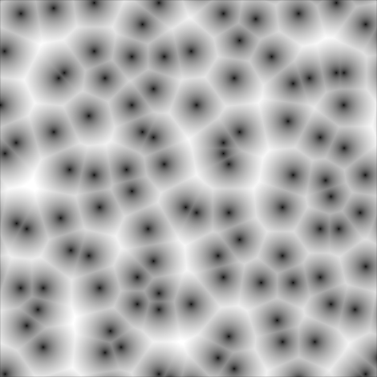

# Examples

## Worley

Also known as Voronoi or cell noise.

[worley.rs](/examples/worley.rs) on the CPU

```sh
cargo run --example worley
```

[worley_shader.rs](/examples/worley_shader.rs) for the GPU

```sh
cargo run --example worley_shader
```



## Domain warping

A technique that distorts the position before feeding it to the noise, inspired by [Inigo Quilez](https://iquilezles.org/articles/warp).

[domain_warping_shader.rs](/examples/domain_warping_shader.rs)


